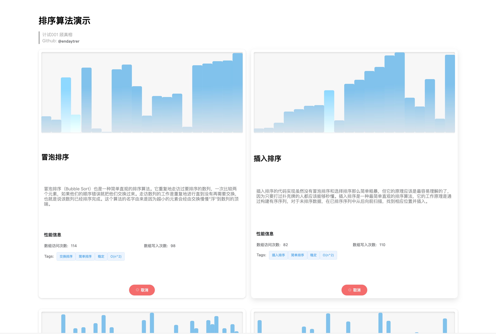

# sort-demo-vue3

本项目是课程“数据结构与算法”的大作业, 是一个用于展示的网页. 网页地址: [http://sort.yethon.org](http://sort.yethon.org) (架设在宿舍的服务器上, 校外需要VPN).



这个演示是一个前端项目. 使用Vue3编写, 并且使用了Element Plus组件库, 可以通过动画演示各种排序的原理和性能. 这个演示可以修改是否开启动画、排序动作延时, 自定义的数组, 可以通过调缓动作来清晰了解算法内部原理; 或者关闭动画来更快比较各种排序的性能. 用户也可以随时停止排序.

在排序过程中, 用户可以通过悬浮鼠标来读取每个条所对应的值. 若条被高亮了, 说明这个条正在被读取. 若两个条位置发生了交换, 则说明它们的值发生了交换操作; 若高度发生了变化, 则说明这个位置被写入了新的值.

本演示采用了Javascript `async`异步的编写模式, 可以进行多线程的排序操作, 方便比较. 本演示采用的语言主要是Typescript, 通过类型验证来提高鲁棒性; 同时本演示通过函数式编程的思想, 提高整体的封装性和可复用性. 为开发者提供了实现几乎各种排序的可能性.

开发者只要实例化如下的对象:

```typescript
export default class SortingMethod {
  /**
   *
   * @async sort 排序方法
   * 你可以在这个方法内写排序函数. 你可能调用到如下函数来辅助你的排序:
   * @param size {number} 你会得到带排序数组的大小.
   * @param get {(index: number) => Promise<number>} 通过`await get(i)` 来获取数组中第`i`个元素的值.
   * @param swap {(index1: number, index2: number) => Promise<void>} 通过`await swap(i, j)` 来获交换组中第`i`个和第`j`个元素的值.
   * @param assign {(index: number, value: number) => Promise<number>} 通过`await assign(i, val)` 来将数组中第`i`个元素的值赋值为`val`.
   */
  sort: (
    size: number,
    get: (index: number) => Promise<number>,
    swap: (index1: number, index2: number) => Promise<void>,
    assign: (index: number, value: number) => Promise<void>
  ) => Promise<void>;
  constructor(
    sort: (
      size: number,
      get: (index: number) => Promise<number>,
      swap: (index1: number, index2: number) => Promise<void>,
      assign: (index: number, value: number) => Promise<void>
    ) => Promise<void>
  ) {
    this.sort = sort;
  }
}
```

就可以实现一种排序方法. 例如冒泡排序:

```typescript
export const bubbleSort: SortingMethod = new SortingMethod(
  async (
    size: number,
    get: (index: number) => Promise<number>,
    swap: (index1: number, index2: number) => Promise<void>
  ) => {
    for (let i = size - 1; i >= 0; i--) {
      for (let j = 1; j <= i; j++) {
        if ((await get(j - 1)) > (await get(j))) {
          await swap(j - 1, j);
        }
      }
    }
  }
);
```

然后调用Vue组件, 在名为`sortObject`的prop里传入这个对象, 即可创建一种新的排序的演示. 例如:

```html
<demo-container
        :sortObject="insertionSort"
        :originalSize="20"
        :originalAnimation="true"
        :originalDelay="500"
        sortName="插入排序"
        :tags="['插入排序', '简单排序', '稳定', 'O(n^2)']"
      />

```

## 如何本地测试和开发

1. 安装依赖

    ```bash
    npm install
    ```

2. 本地热更新运行

    ```bash
    npm run serve
    ```

3. 部署: 编译成最简文件

    ```bash
    npm run build
    ```

4. 配置nginx, 并通过通过nginx部署. live server, Apache等也是可选的:

    ```bash
    nginx
    
    # 关闭服务器
    nginx -s stop
    
    # 重启服务器
    nginx -s reload
    ```

## 自定义配置

见 [Configuration Reference](https://cli.vuejs.org/config/).

